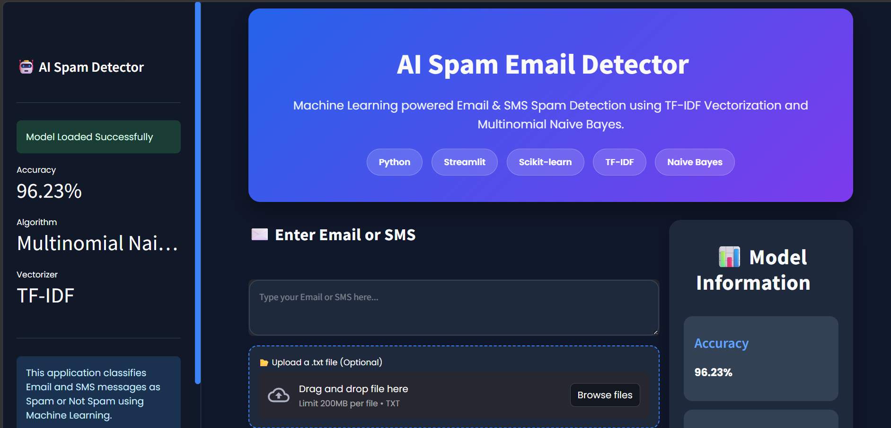
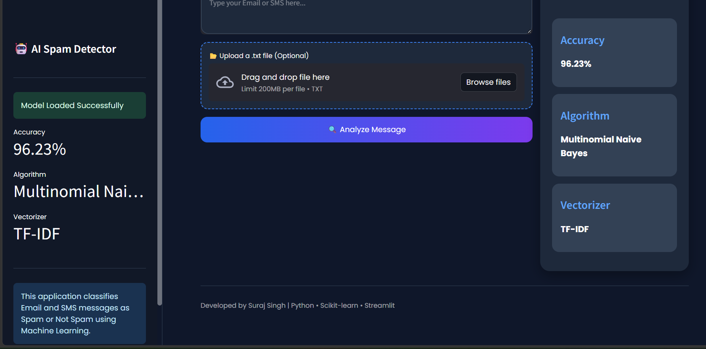

<<<<<<< HEAD

<p align="center">
  
</p>

<h1 align="center">AI Spam Email Detector</h1>

<p align="center">
Machine Learning based Email & SMS Spam Detection using TF-IDF and Multinomial Naive Bayes
</p>


<p align="center">


</p>

---

# Overview

AI Spam Email Detector is a machine learning application that predicts whether an Email or SMS message is **Spam** or **Not Spam (Ham)**.

The project uses Natural Language Processing (NLP) techniques to convert text into numerical features using **TF-IDF Vectorization** and performs classification using the **Multinomial Naive Bayes** algorithm.

The application is deployed through **Streamlit**, providing an interactive web interface for real-time spam detection.

---

# Features

- Spam and Ham Classification
- Machine Learning Based Prediction
- TF-IDF Text Vectorization
- Multinomial Naive Bayes Classifier
- Prediction Confidence Score
- Interactive Probability Chart
- Spam Keyword Detection
- Message Statistics
- Text File Upload Support
- Responsive User Interface
- Modern Dark Theme

---

# Technologies Used

| Category | Technology |
|-----------|------------|
| Language | Python |
| Frontend | Streamlit |
| Machine Learning | Scikit-learn |
| Data Processing | Pandas |
| Numerical Computing | NumPy |
| Visualization | Plotly |
| Model Storage | Pickle |

---

# Machine Learning Pipeline

```
SMS / Email
      │
      ▼
Text Preprocessing
      │
      ▼
TF-IDF Vectorizer
      │
      ▼
Multinomial Naive Bayes
      │
      ▼
Spam / Ham Prediction
```

---

# Model Information

| Property | Value |
|----------|-------|
| Algorithm | Multinomial Naive Bayes |
| Feature Extraction | TF-IDF Vectorizer |
| Dataset | SMS Spam Collection Dataset |
| Accuracy | 96.23% |

---

# Application Features

The application provides the following functionalities:

- Real-time spam prediction
- Confidence score visualization
- Interactive probability chart
- Message statistics
- Spam keyword detection
- Text file upload support
- Responsive interface
- Clean and modern UI

---

# Project Structure

```text
Spam_Email_Classifier/
│
├── assets/
│   ├── banner.png
│   ├── home.png
│   ├── spam.png
│   ├── ham.png
│   └── chart.png
│
├── styles/
│   └── style.css
│
├── app.py
├── train_model.py
├── spam.csv
├── model.pkl
├── vectorizer.pkl
├── requirements.txt
└── README.md
```

---

# Installation

## Clone the repository

```bash
git clone https://github.com/Suraj2007-del/Spam_email_.git
```

## Move into the project folder

```bash
cd Spam_email_
```

## Install dependencies

```bash
pip install -r requirements.txt
```

## Run the application

```bash
streamlit run app.py
```

---
## Screenshots
v
### Home Page (top)

<p align="center">
  
</p>
 
 ### Home Page (bottom)
 
<p align="center">
  
</p>
---

### Spam Detection

#### Prediction

<p align="center">
  
</p>

#### Statistics & Spam Keywords

<p align="center">
  
</p>

---

### Ham Detection

#### Prediction

<p align="center">
  
</p>

#### Statistics

<p align="center">
  
</p>

---

### 📊 Message Statistics

<p align="center">
  
</p>

---

# Future Enhancements

- Deep Learning based Spam Detection
- Transformer Models (BERT)
- Email Attachment Analysis
- Multi-language Spam Detection
- User Authentication
- Database Integration
- Cloud Deployment
- API Integration
- Light/Dark Theme Toggle
- Model Performance Dashboard

---

# Learning Outcomes

This project demonstrates:

- Natural Language Processing (NLP)
- Text Vectorization using TF-IDF
- Machine Learning Classification
- Model Serialization using Pickle
- Interactive Web Application Development
- Data Visualization
- Streamlit Deployment

---

# Author

**Suraj Singh**

B.Tech Computer Science Engineering

Machine Learning Enthusiast

GitHub: [Suraj2007-del](https://github.com/Suraj2007-del)

LinkedIn: *Add your LinkedIn profile link here*

---

# License

This project is created for educational and portfolio purposes.

---

<p align="center">

Made with Python, Streamlit and Scikit-learn.

</p>
=======
# Spam_email_
>>>>>>> 4ede08714237260cae09cfcbba68e9a94462137e
